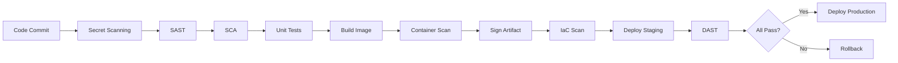

# DevSecOps Security Scans Examples

Este repositório contém exemplos completos de configurações de segurança para pipelines DevSecOps, demonstrando as melhores práticas de segurança em todas as fases do ciclo de desenvolvimento.

## 🎯 Objetivo

Demonstrar a implementação de verificações de segurança automatizadas em um pipeline CI/CD completo, incluindo:

- **SCA (Software Composition Analysis)**: Análise de vulnerabilidades em dependências com OWASP Dependency-Check
- **SAST (Static Application Security Testing)**: Análise estática de código com Semgrep, SonarQube ou CodeQL
- **DAST (Dynamic Application Security Testing)**: Testes dinâmicos com OWASP ZAP
- **Secret Scanning**: Detecção de credenciais expostas com GitLeaks ou TruffleHog
- **IaC Scanning**: Análise de arquivos Terraform/CloudFormation com Checkov ou Terrascan
- **Container Scanning**: Verificação de vulnerabilidades em imagens Docker com Trivy ou Grype
- **Assinatura de Artefatos**: Garantia de integridade com Cosign/Sigstore
- **Deploy Seguro**: Pipeline completo de deployment com validações de segurança

## 📁 Estrutura do Projeto

```
.
├── .github/
│   └── workflows/
│       ├── security.yaml         # Pipeline de verificações de segurança
│       ├── sast.yaml            # Análise estática de código
│       ├── dast.yaml            # Testes dinâmicos
│       ├── secrets.yaml         # Detecção de secrets
│       ├── iac.yaml             # Scan de infraestrutura
│       ├── container.yaml       # Scan de containers
│       └── deploy.yaml          # Pipeline de deploy
├── infrastructure/              # Arquivos IaC (Terraform/CloudFormation)
├── docker/                      # Dockerfiles e configurações
├── src/                         # Código fonte da aplicação
├── package.json                 # Dependências do projeto (Node.js)
├── index.js                     # Aplicação exemplo
├── Dockerfile                   # Imagem Docker da aplicação
└── README.md                    # Este arquivo
```

## 🚀 Como Funciona

Os workflows de segurança são executados automaticamente quando:
- Código é enviado para as branches `main` ou `develop`
- Um Pull Request é criado
- Semanalmente aos domingos (scans agendados)
- Em cada release (para assinatura de artefatos)

## 🔍 Ferramentas de Segurança Implementadas

### 1. SCA - Software Composition Analysis
**Ferramenta**: OWASP Dependency-Check
- Analisa dependências em busca de CVEs conhecidos
- Gera relatórios em HTML, JSON e SARIF
- Integração com GitHub Security

### 2. SAST - Static Application Security Testing
**Ferramentas**: Semgrep, CodeQL, SonarQube
- Detecta vulnerabilidades no código-fonte
- Identifica código inseguro, SQL Injection, XSS, etc.
- Análise de qualidade de código

### 3. DAST - Dynamic Application Security Testing
**Ferramenta**: OWASP ZAP
- Testa a aplicação em execução
- Identifica vulnerabilidades em tempo de execução
- Simula ataques reais

### 4. Secret Scanning
**Ferramentas**: GitLeaks, TruffleHog
- Detecta credenciais hardcoded
- Identifica tokens, API keys, senhas
- Previne vazamento de secrets

### 5. IaC Scanning
**Ferramentas**: Checkov, Terrascan, Trivy
- Analisa arquivos Terraform, CloudFormation, Kubernetes
- Detecta misconfigurations de segurança
- Valida compliance com políticas

### 6. Container Scanning
**Ferramentas**: Trivy, Grype, Snyk
- Escaneia imagens Docker
- Detecta CVEs em pacotes do sistema
- Verifica configurações inseguras

### 7. Assinatura de Artefatos
**Ferramenta**: Cosign/Sigstore
- Assina imagens Docker
- Garante integridade e proveniência
- Implementa supply chain security

### 8. Deploy Seguro
- Validações de segurança antes do deploy
- Blue-Green ou Canary deployment
- Rollback automático em caso de problemas

## ⚠️ Vulnerabilidades Intencionais

Este projeto contém vulnerabilidades propositais para demonstrar as ferramentas:

### Dependências Vulneráveis (SCA)
- `express 4.17.1` - CVEs conhecidos
- `lodash 4.17.19` - Prototype pollution
- `axios 0.21.1` - SSRF vulnerabilities
- `minimist 1.2.5` - Prototype pollution
- `jquery 3.4.1` - XSS vulnerabilities

### Código Vulnerável (SAST)
- SQL Injection
- XSS (Cross-Site Scripting)
- Path Traversal
- Insecure Deserialization

### Secrets Expostos
- API keys hardcoded
- Senhas em texto claro
- Tokens de acesso

### IaC Misconfiguration
- Portas abertas desnecessariamente
- Criptografia desabilitada
- Permissões excessivas

**⚠️ ATENÇÃO**: Este é um projeto de exemplo para fins educacionais. Nunca use estas configurações em produção!

## Executando o Projeto

```bash
# Instalar dependências
npm install

# Executar aplicação
npm start
```

## 📊 Verificando Resultados

### GitHub Actions
1. Acesse a aba **Actions** no GitHub
2. Selecione o workflow desejado (Security Scans, SAST, DAST, etc.)
3. Baixe os artifacts gerados
4. Revise os logs de execução

### GitHub Security
1. Acesse **Security** > **Code scanning alerts**
2. Revise as vulnerabilidades encontradas por SAST e SCA
3. Acesse **Secret scanning alerts** para secrets detectados
4. Veja **Dependabot alerts** para dependências

### Relatórios Gerados

Cada ferramenta gera relatórios específicos:

**SCA (OWASP Dependency-Check)**
- `dependency-check-report.html` - Relatório visual
- `dependency-check-report.json` - Dados estruturados
- `dependency-check-report.sarif` - GitHub Security

**SAST (Semgrep/CodeQL)**
- `semgrep-results.sarif` - Vulnerabilidades de código
- `codeql-results.sarif` - Análise do CodeQL

**DAST (OWASP ZAP)**
- `zap-report.html` - Relatório de scan dinâmico
- `zap-report.json` - Dados estruturados

**Secret Scanning (GitLeaks)**
- `gitleaks-report.json` - Secrets detectados

**IaC Scanning (Checkov)**
- `checkov-report.sarif` - Misconfigurations

**Container Scanning (Trivy)**
- `trivy-results.sarif` - Vulnerabilidades da imagem

## 🔐 Configuração de Secrets

Configure os seguintes secrets no GitHub:

```
NVD_API_KEY           # API do National Vulnerability Database
SONARQUBE_TOKEN       # Token do SonarQube
DOCKER_USERNAME       # Usuário Docker Hub
DOCKER_PASSWORD       # Senha Docker Hub
COSIGN_PASSWORD       # Senha para assinatura de artefatos
DEPLOY_KEY            # Chave SSH para deploy
SLACK_WEBHOOK_URL     # Webhook para notificações
```

## 🚢 Pipeline DevSecOps Completo



## 🛠️ Melhorias e Personalizações

### Gates de Qualidade
- Configure thresholds para falhar o build
- Defina severidade mínima aceitável (MEDIUM, HIGH, CRITICAL)
- Implemente políticas de zero critical vulnerabilities

### Notificações
- Slack/Teams para alertas de vulnerabilidades
- Email para relatórios semanais
- Dashboard centralizado (DefectDojo, Dependency-Track)

### Integração Contínua
- Branch protection rules
- Require security scans antes de merge
- Automated dependency updates (Dependabot, Renovate)

### Monitoramento em Produção
- Runtime Application Self-Protection (RASP)
- Security Information and Event Management (SIEM)
- Continuous monitoring com falco/sysdig
